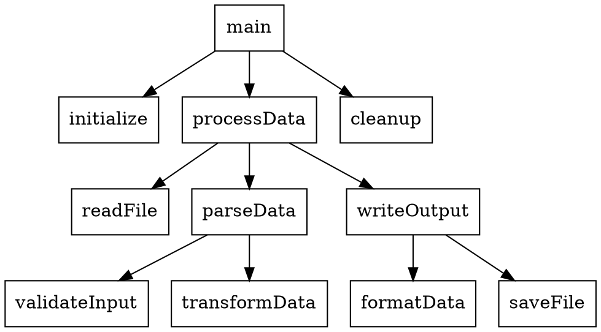
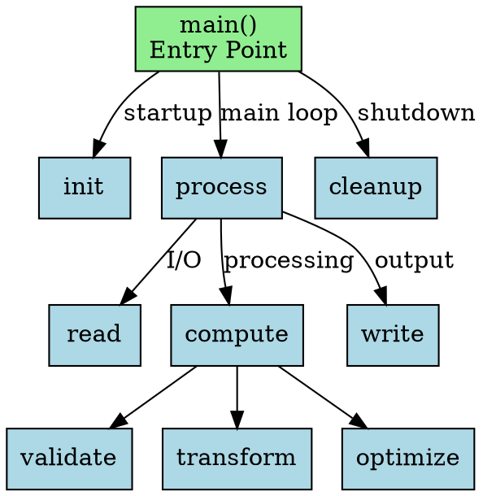

# Callgraph Viewer

A modern, interactive web-based application for visualizing DOT callgraph files with support for node dragging, collapsing subsections, and dynamic exploration.

**✨ New:** Built-in Go code analyzer! Select a folder directly in the browser to generate callgraphs on the fly - no command-line tools needed!

## Project Structure

- **Web Viewer** (`/`): Interactive web application for visualizing DOT files
- **Browser-based Go Analyzer**: Generate callgraphs from Go folders directly in your browser
- **DOT Generator** (`/dotgen`): Command-line tool to generate callgraphs from Go code

## Features

### Visualization
- **DOT File Support**: Load and parse standard DOT/Graphviz files
- **Generate from Go Folder**: Select a Go project folder and generate callgraph instantly in the browser
- **Interactive Visualization**: Drag nodes to reposition them, zoom, and pan
- **Smart Collapse/Expand**: 
  - One-click "Collapse All" to show only entry functions (great for large graphs!)
  - Granular control: Right-click nodes to collapse/expand outgoing, incoming, or all connections
- **Context-Aware Menus**: Only shows applicable actions based on node state
- **Node Details**: Click on any node to view detailed information
- **Export**: Save your graph as a PNG image
- **Modern UI**: Beautiful, responsive design with gradient backgrounds
- **Left-to-Right Layout**: Horizontal flow for better visibility on wide screens
- **Real-time Stats**: View node and edge counts
- **Visual State Indicators**: Border shows outgoing state, background shows incoming state

## Getting Started

### Prerequisites

**For the Web Viewer:**
- Node.js (version 14 or higher)
- npm (comes with Node.js)

**For the DOT Generator (optional):**
- Go (version 1.21 or higher)

### Installation

1. Clone or download this repository
2. Navigate to the project directory:
   ```bash
   cd callgraph
   ```

3. Install dependencies:
   ```bash
   npm install
   ```

### Running the Application

1. Start the local server:
   ```bash
   npm start
   ```

2. Your default browser will automatically open to `http://localhost:3000`

**Browser Requirements:**
- For **folder analysis** feature: Chrome, Edge, or other Chromium-based browsers (requires File System Access API)
- For **DOT file viewing**: Any modern browser (Chrome, Firefox, Safari, Edge)

## Usage

### Option 1: Generate Callgraph Directly in Browser (Easiest!)

1. Click the **"🚀 Generate from Go Folder"** button
2. Select your Go project folder
3. The callgraph will be automatically generated and displayed!

**Features:**
- ✅ No command-line tools needed
- ✅ Works entirely in the browser
- ✅ Instant visualization
- ✅ Automatically excludes `_test.go` files and `vendor/` directories

### Option 2: Use Pre-generated DOT Files

If you have existing DOT files or prefer using the command-line tool:

#### Step 1: Generate a Callgraph from Go Code (Optional)

Navigate to the `dotgen` directory and build the tool:

```bash
cd dotgen
make build
```

Generate a callgraph from your Go project:

```bash
./dotgen -path /path/to/your/go/project -output mycallgraph.dot -verbose
```

Or try the example:

```bash
make example
```

See the [dotgen README](dotgen/README.md) for more options.

#### Step 2: Load DOT File in the Web Viewer

1. Start the web viewer (if not already running):
   ```bash
   npm start
   ```
2. Click "📁 Choose DOT File" button
3. Select your generated `.dot` file
4. The graph will automatically render - explore interactively!

### Interacting with the Graph

- **Drag nodes**: Click and drag any node to reposition it
- **Pan the view**: Click and drag on empty space to move the entire graph
- **Zoom**: Use mouse wheel to zoom in/out
- **View details**: Click once on a node to see its details in the side panel
- **Collapse/Expand**: 
  - **📦 Collapse All** button: Collapses entire graph to show only entry functions (starting points with no callers)
  - **📂 Expand All** button: Expands all nodes to show full graph
  - **Right-click a node** to open the context menu with options:
    - **Collapse:** Outgoing Calls, Incoming Calls, or All Connections
    - **Expand:** All, Outgoing Calls only, or Incoming Calls only
  - **Double-click a node** to quickly collapse/expand all connections
- **Help**: Click "Help" button to show the quick guide (close with Esc key or click outside)
- **Fit to view**: Click "Fit to View" button to zoom to see the entire graph
- **Zoom to text**: Click "Zoom to Text" button to zoom until text is readable (12px minimum)
- **Reset**: Click "Reset Layout" to restore the original graph state
- **Export**: Click "Export PNG" to save the current view as an image

### Node Colors

**Border = Outgoing State | Background = Incoming State**

- **White background + Blue border (2px)**: All connections visible
- **White background + Dark gray border (4px)**: Outgoing collapsed (children hidden)
- **Gray background + Blue border (2px)**: Incoming collapsed (parents hidden)
- **Gray background + Dark gray border (4px)**: Both collapsed (all hidden)
- **Yellow flash**: Node you just acted on (fades to normal in 3 seconds)

## Example DOT File

Here's a simple example of a DOT callgraph file:



You can create more complex callgraphs with additional attributes:



## Technical Details

### Dependencies

- **vis-network**: Graph visualization library with DOT parsing support
- **http-server**: Simple local development server

### Browser Compatibility

The application works on all modern browsers:
- Chrome/Edge (version 90+)
- Firefox (version 88+)
- Safari (version 14+)

### Architecture

- `index.html`: Main HTML structure
- `styles.css`: Modern, responsive styling with CSS variables
- `app.js`: Main application logic using ES6 classes
- `package.json`: Node.js dependencies and scripts

## Tips for Large Graphs

- Use the collapse feature to simplify complex graphs
- Double-click high-level nodes to hide implementation details
- Use the zoom and pan features to navigate large callgraphs
- Export specific views as images for documentation

## Troubleshooting

### Graph doesn't render
- Ensure your DOT file syntax is valid
- Check the browser console for error messages
- Try with a simple example first

### Performance issues with large graphs
- Collapse unnecessary sections
- Consider splitting very large graphs into multiple files
- Disable physics simulation for better performance with 1000+ nodes

### Export doesn't work
- Ensure you're using a modern browser
- Check browser permissions for file downloads

## License

MIT License - feel free to use and modify for your projects!

## Contributing

Contributions are welcome! Feel free to submit issues or pull requests.

## Future Enhancements

- Search functionality to find specific nodes
- Filter by node attributes
- Multiple layout algorithms
- Save/load graph state
- Dark mode support
- Cluster detection and grouping

