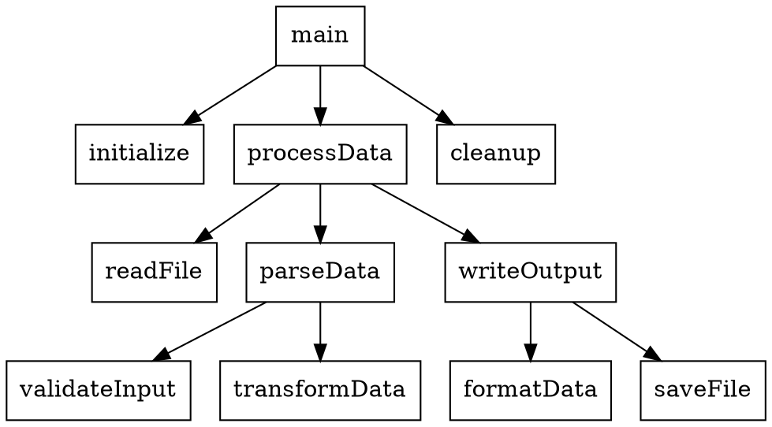
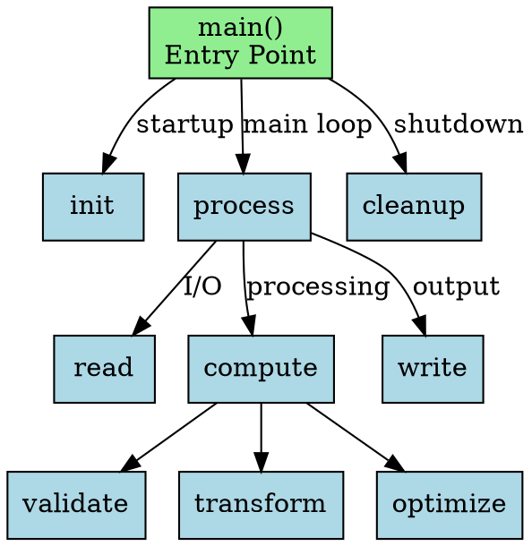

# Callgraph Viewer

A modern, interactive web-based application for visualizing DOT callgraph files with support for node dragging, collapsing subsections, and dynamic exploration.

**✨ New:** Includes `dotgen` - a Go-based tool to generate DOT callgraphs from Go codebases!

## Project Structure

- **Web Viewer** (`/`): Interactive web application for visualizing DOT files
- **DOT Generator** (`/dotgen`): Command-line tool to generate callgraphs from Go code

## Features

- **DOT File Support**: Load and parse standard DOT/Graphviz files
- **Interactive Visualization**: Drag nodes to reposition them, zoom, and pan
- **Collapse/Expand**: Double-click nodes to collapse/expand their connections
- **Node Details**: Click on any node to view detailed information
- **Export**: Save your graph as a PNG image
- **Modern UI**: Beautiful, responsive design with gradient backgrounds
- **Hierarchical Layout**: Automatic layout of callgraph with proper hierarchy
- **Real-time Stats**: View node and edge counts

## Getting Started

### Prerequisites

**For the Web Viewer:**
- Node.js (version 14 or higher)
- npm (comes with Node.js)

**For the DOT Generator (optional):**
- Go (version 1.21 or higher)

### Installation

1. Clone or download this repository
2. Navigate to the project directory:
   ```bash
   cd callgraph
   ```

3. Install dependencies:
   ```bash
   npm install
   ```

### Running the Application

1. Start the local server:
   ```bash
   npm start
   ```

2. Your default browser will automatically open to `http://localhost:8080`

Alternatively, you can simply open `index.html` in a modern web browser (Chrome, Firefox, Safari, Edge).

## Complete Workflow: Analyze Go Code → Visualize

### Step 1: Generate a Callgraph from Go Code

Navigate to the `dotgen` directory and build the tool:

```bash
cd dotgen
make build
```

Generate a callgraph from your Go project:

```bash
./dotgen -path /path/to/your/go/project -output mycallgraph.dot -verbose
```

Or try the example:

```bash
make example
```

See the [dotgen README](dotgen/README.md) for more options.

### Step 2: Visualize in the Web App

1. Copy your generated `.dot` file to the main directory (or remember its location)
2. Start the web viewer:
   ```bash
   cd ..  # back to main directory
   npm start
   ```
3. Click "Choose DOT File" and select your generated callgraph
4. Explore interactively!

## Usage

### Loading a Callgraph

1. Click the "Choose DOT File" button
2. Select a `.dot` or `.gv` file from your computer
3. The graph will automatically render

### Interacting with the Graph

- **Drag nodes**: Click and drag any node to reposition it
- **Pan the view**: Click and drag on empty space to move the entire graph
- **Zoom**: Use mouse wheel to zoom in/out
- **View details**: Click once on a node to see its details in the side panel
- **Collapse/Expand**: 
  - **Right-click a node** to open the context menu with options:
    - **Collapse:** Outgoing Calls, Incoming Calls, or All Connections
    - **Expand:** All, Outgoing Calls only, or Incoming Calls only
  - **Double-click a node** to quickly collapse/expand all connections
- **Help**: Click "💡 Help" button to show the quick guide (close with Esc key or click outside)
- **Fit to view**: Click "🔍 Fit to View" button to zoom to see the entire graph
- **Reset**: Click "🔄 Reset Layout" to restore the original graph state
- **Export**: Click "💾 Export PNG" to save the current view as an image

### Node Colors

**Border = Outgoing State | Background = Incoming State**

- **White background + Blue border (2px)**: All connections visible
- **White background + Dark gray border (4px)**: Outgoing collapsed (children hidden)
- **Gray background + Blue border (2px)**: Incoming collapsed (parents hidden)
- **Gray background + Dark gray border (4px)**: Both collapsed (all hidden)
- **Yellow flash**: Node you just acted on (fades to normal in 3 seconds)

## Example DOT File

Here's a simple example of a DOT callgraph file:



You can create more complex callgraphs with additional attributes:



## Technical Details

### Dependencies

- **vis-network**: Graph visualization library with DOT parsing support
- **http-server**: Simple local development server

### Browser Compatibility

The application works on all modern browsers:
- Chrome/Edge (version 90+)
- Firefox (version 88+)
- Safari (version 14+)

### Architecture

- `index.html`: Main HTML structure
- `styles.css`: Modern, responsive styling with CSS variables
- `app.js`: Main application logic using ES6 classes
- `package.json`: Node.js dependencies and scripts

## Tips for Large Graphs

- Use the collapse feature to simplify complex graphs
- Double-click high-level nodes to hide implementation details
- Use the zoom and pan features to navigate large callgraphs
- Export specific views as images for documentation

## Troubleshooting

### Graph doesn't render
- Ensure your DOT file syntax is valid
- Check the browser console for error messages
- Try with a simple example first

### Performance issues with large graphs
- Collapse unnecessary sections
- Consider splitting very large graphs into multiple files
- Disable physics simulation for better performance with 1000+ nodes

### Export doesn't work
- Ensure you're using a modern browser
- Check browser permissions for file downloads

## License

MIT License - feel free to use and modify for your projects!

## Contributing

Contributions are welcome! Feel free to submit issues or pull requests.

## Future Enhancements

- Search functionality to find specific nodes
- Filter by node attributes
- Multiple layout algorithms
- Save/load graph state
- Dark mode support
- Cluster detection and grouping

