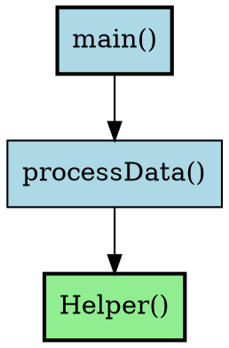

# DOT Callgraph Generator for Go

A command-line tool that analyzes Go codebases and generates DOT format callgraph files. These can be visualized using the web-based callgraph viewer in the parent directory.

## Features

- **Fast Go AST Parsing**: Analyzes Go source code using the standard `go/ast` package
- **Package-Aware**: Groups functions by package with color coding
- **Method Support**: Properly handles both functions and methods with receivers
- **Flexible Filtering**: Exclude directories (vendor, testdata, etc.)
- **Clean Output**: Generates well-formatted DOT files compatible with Graphviz
- **Cross-Platform**: Works on macOS, Linux, and Windows

## Installation

### Build from Source

```bash
cd dotgen
go mod download
go build -o dotgen
```

This will create a `dotgen` executable in the current directory.

### Install Globally

```bash
cd dotgen
go install
```

This installs the `dotgen` command to your `$GOPATH/bin`.

## Usage

### Basic Usage

Generate a callgraph for the current directory:

```bash
./dotgen
```

### Specify a Path

Analyze a specific Go project:

```bash
./dotgen -path /path/to/go/project
```

### Custom Output File

Specify where to save the DOT file:

```bash
./dotgen -path ./myproject -output myproject-callgraph.dot
```

### Exclude Directories

Exclude vendor, testdata, and other directories:

```bash
./dotgen -path ./myproject -exclude vendor,testdata,.git
```

### Verbose Output

See detailed progress information:

```bash
./dotgen -path ./myproject -verbose
```

### All Options

```bash
./dotgen -help
```

**Available Flags:**

- `-path string`: Path to Go codebase to analyze (default: current directory)
- `-output string`: Output DOT file path (default: "callgraph.dot")
- `-depth int`: Maximum call depth to analyze (-1 for unlimited, default: -1)
- `-exclude string`: Comma-separated directories to exclude (e.g., "vendor,testdata")
- `-verbose`: Enable verbose output

## Example

Analyze a Go project and generate a callgraph:

```bash
# Generate callgraph
./dotgen -path ~/projects/myapp -output myapp.dot -verbose

# Open in web viewer
# Copy myapp.dot to the parent directory and load it in the browser
```

## Output Format

The tool generates DOT files with the following features:

- **Nodes**: Represent functions and methods
  - Box shape with rounded corners
  - Color-coded by package
  - Bold outline for exported functions
  - Labels show function/method names

- **Edges**: Represent function calls
  - Directed arrows from caller to callee
  - Deduplicated (no duplicate edges)

- **Clusters**: Package subgraphs (when useful)
  - Groups related functions
  - Shows package boundaries

## Example Output



## Integration with Web Viewer

1. Generate a DOT file using this tool:
   ```bash
   ./dotgen -path ./myproject -output callgraph.dot
   ```

2. Open the web viewer (from parent directory):
   ```bash
   cd ..
   npm start
   ```

3. In the browser, click "Choose DOT File" and select your generated `callgraph.dot`

4. Explore your callgraph interactively!

## Limitations

- **Static Analysis Only**: Only detects calls visible in the AST (no reflection, dynamic calls)
- **Interface Calls**: Interface method calls are approximated
- **External Packages**: Only analyzes code in the specified directory
- **Test Files**: Test files (`*_test.go`) are excluded by default

## Advanced Examples

### Analyze a Specific Package

```bash
./dotgen -path ./internal/api -output api-callgraph.dot
```

### Large Projects

For large projects, exclude unnecessary directories:

```bash
./dotgen -path ~/go/src/large-project \
  -exclude "vendor,node_modules,testdata,examples,docs" \
  -output large-project.dot \
  -verbose
```

### Multiple Outputs

Generate callgraphs for different parts of your project:

```bash
./dotgen -path ./cmd/server -output server.dot
./dotgen -path ./internal/core -output core.dot
./dotgen -path ./pkg/utils -output utils.dot
```

## Troubleshooting

### No Functions Found

- Ensure the path contains `.go` files
- Check that files are valid Go syntax
- Use `-verbose` to see which files are being parsed

### Parse Errors

- The tool continues on parse errors and logs warnings
- Check that your Go code compiles with `go build`

### Large Output Files

- Use `-exclude` to skip large vendor directories
- Consider analyzing subsections of your codebase separately
- Some graph viewers may struggle with 1000+ nodes

## Technical Details

### Dependencies

- `golang.org/x/tools`: Go AST analysis utilities

### How It Works

1. **File Discovery**: Walks directory tree to find `.go` files
2. **AST Parsing**: Parses each file into an Abstract Syntax Tree
3. **Function Extraction**: Identifies all function and method declarations
4. **Call Analysis**: Walks function bodies to find call expressions
5. **Graph Building**: Constructs a callgraph data structure
6. **DOT Generation**: Converts the graph to DOT format

### Performance

- Typical projects (100-500 files): < 1 second
- Large projects (1000+ files): 2-5 seconds
- Very large projects (5000+ files): 10-30 seconds

## Contributing

Contributions welcome! This tool is designed to be simple and extensible.

Possible enhancements:
- Support for filtering by function name patterns
- Depth-limited graphs
- Interactive filtering
- Support for external package analysis
- Call frequency/weight information

## License

MIT License - Free to use and modify!

